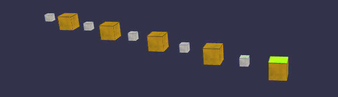

# LinearCloner

The LinearCloner clones and distributes given meshes in a linear manner. If more than one mesh is provided, then the clones will be placed subsequently one after another. The LinearCloner can instantiated in two different interpolation-modes: absolute and relative mode. Absolute interpolation mode implies that the transformation input parameters (scale/rotation/position) are assigned for the last clone and the clones between the first and last clone are interpolated linear. In contrast, the relative interpolation mode implies that these parameters are the deltas from clone to clone. 
The LinearCloner returns an object with an important property: **root**. It is an invisible mesh, it's the anchor and parent of all generated clones, its position is the position of the first clone. Transforming this **root** (position/scale/rotation) affects all underlying clones (childs) at once independently of the interpolation mode. Most of the input parameters are also available as properties and they are very suitable for animation (tweening). The given input meshes will be made inactive during construction, so after construction there will be only one of two possible mesh types: BABYLON **clones** or **instances**.  
*Note:* Input meshes can be BABYLON meshes but other Cloners as well!

### Example
Example of a LinearCloner with a count of 10 clones (5 x cube1, 5 x cube2) with an increment vector of {x:2,y:0,z:-1} :

`var lc = new BABYLONX.LinearCloner([cube1, cube2], demo.scene, { iModeStep:true,count:10,P:{x:2,y:0,z:-1} });`

Transforming of all clones can be done as you would do with a single mesh:

`rc.root.scaling.y = 2;`
`rc.root.rotation.x = Math.PI / 4;`

Animation can be done via properties:

`BABYLON.Animation.CreateAndStartAnimation('radanimation', rc, 'startangle', 30, 120, 0, 90);`

### Parameters
`BABYLONX.LinearCloner( meshes, scene[, {optional parameters}])` 

Mandatory Parameter | Description 
--------------------|------------
meshes| array of meshes/cloners to be cloned, meshes will be made inactive after construction
scene|BABYLON scene

Optional Parameter | Description | Default Value
-------------------|-------------|--------------
count | the nuber of clones | 3
radius| radius in world units | 3
align| flag if clones are aligned against the middle position of the cloner |true
startangle| angle in degrees | 0
endangle| angle in degrees | 360
offset| angle in degrees| 0
useInstances| flag if clones should be technical "clones" or "instances" | true
plane | object {x,y,z} describing the cloners orientation |{ x: 1, y: 0, z: 1 }

Properties | Description 
------------|-------------
count |@see Optional Parameter
radius| @see Optional Parameter
align| @see Optional Parameter
startangle| @see Optional Parameter
endangle| @see Optional Parameter
offset| @see Optional Parameter
root| READONLY, getting an invisibe mesh representing the anchor of the cloner (root node)
effectors| READONLY, gets a list of Effectors assigned to this Cloner
