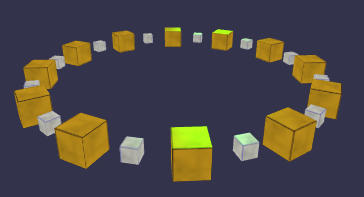

# RadialCloner

The RadialCloner distributes given meshes in a radial manner. If more meshes are provided, they will be placed alternatively.

### Example
Example of a RadialCloner (see Image) with 24 clones (12 cubes "cube1" and "cube2") distributed with a radius of 6 units in the plane XZ which is default:

`var rc = new BABYLONX.RadialCloner([cube1, cube2], demo.scene, {count:24,radius:6});`

### Parameters
`BABYLONX.RadialCloner( meshes, scene[, {optional parameters}])` 

Mandatory Parameter | Description 
-------------------|-------------
meshes| array of meshes to be cloned
scene|BABYLON scene

Optional Parameter | Description | Default Value
-------------------|-------------|--------------
count | the nuber of clones | 3
radius| radius in units | 3
align| flag if clones are aligned against the middle position of the cloner |true
startangle| angle in degrees | 0
endangle| angle in degrees | 360
offset| angle in degrees| 0
useInstances| flag if clones should be technical "clones" or "instances" | true
plane | object {x,y,z} describing the cloners orientation |{ x: 1, y: 0, z: 1 }
